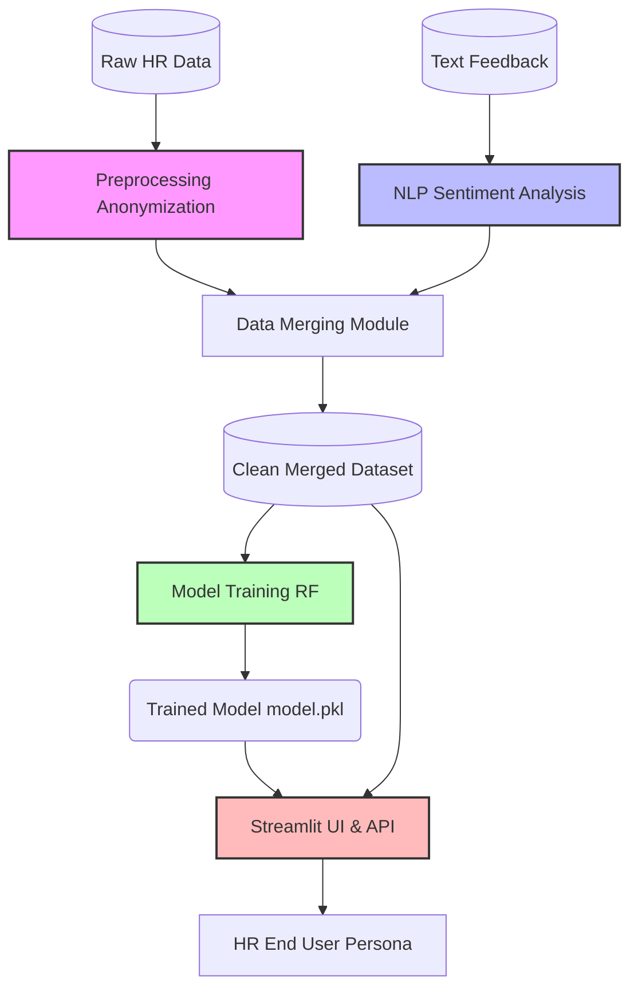

# Architecture Overview

## System Context
The SecureFair AI system ingests HR database records and employee textual feedback, processes them individually, merges the features, and trains a predictive model under strict fairness constraints. A web dashboard then exposes these predictions to HR professionals with Explainable AI overlays.

## Component Flow

## Security & Privacy Boundary
1. **PII Removal Layer**: `preprocess.py` physically separates names, birthdates, and zip codes before data ever touches the training pipeline.
2. **Fairness Isolation**: Protected attributes (e.g., race, gender) never enter the feature vector feeding the model. They are only utilized post-prediction for fairness auditing within the dashboard.
